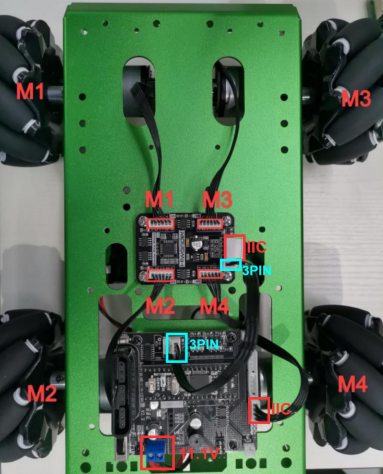

# 

## Motor to device mapping

We use the documented mapping of the driver motor ids to a location in the robot used by hiwonder in the robot kits they offer. 

This is 

| ID | location |
|----|----------|
| M1 | front left |
| M3 | front right |
| M2 | rear left |
| M4 | rear right |

See picture 

